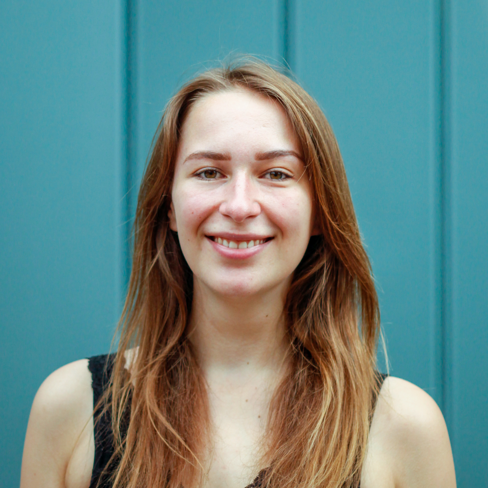

### **Daniel J. Schad**, Principal investigator

  

  
Daniel Schad is full professor of Quantitative Methods at [HMU Health and Medical University Potsdam](https://www.health-and-medical-university.de). He graduated from Potsdam University (Germany) and worked as a postdoc at the Charité in Berlin (Germany; in collaboration with ETH / University Zürich, Switzerland) and at the University of Potsdam. He was assistant professor (tenure track) for Cognitive Science and Artificial Intelligence at Tilburg University in Tilburg (Netherlands) before he started his lab in Potsdam in October 2020.

E-mail: danieljschad@gmail.com
  
  

  

{#id .class width=80% height=80%}

  

### **Laura Wirth**, PhD student

  

  
Laura received her Master in Psychology from the Humboldt University zu Berlin (Germany) and a Bachelor in Psychology from the University of Göttingen (Germany). She joined the lab in December 2022 and works on computational mechanisms in Pavlovian conditioning (Pavlovian-instrumental transfer and sign- versus goal-tracking) as well as on statistical methods.

  

  

{#id .class width=80% height=80%}

  

### **Nassim Sadedin**, student assistant

  

  
Nassim holds a Master in Buisness Administration and has work experience in the industry. He is currently pursuing his bachelor's degree in Psychology at the MSB Medical School Berlin. He joined the lab in October 2021 and works on computational mechanisms of Pavlovian conditioning, on model-free versus model-based instrumental learning (including the influence of mind wandering and relation to subjective self-reports).

  

  

{#id .class width=80% height=80%}

  

### **Miroslav Pap**, student assistant

  

  
Miroslav received his Bachelor in Economics from the Humboldt University zu Berlin (Germany), and has worked in the industry. He is currently pursuing his bachelor's degree in Psychology at the MSB Medical School Berlin. He joined the lab in October 2023 and works on computational mechanisms of Pavlovian conditioning.

  

  

{#id .class width=80% height=80%}

  

