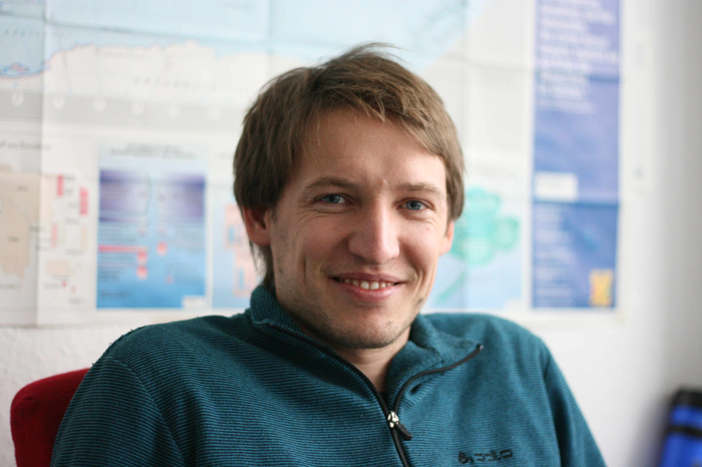

# **Daniel J. Schad**

[google scholar](https://scholar.google.com/citations?user=SmoMdbwAAAAJ&hl=de), 
[researchgate](https://www.researchgate.net/profile/Daniel_Schad), 
[ORCID](https://orcid.org/0000-0003-2586-6823), 
[loop](https://loop.frontiersin.org/people/103261/overview)

[Lab website Shravan Vasishth](http://www.ling.uni-potsdam.de/~vasishth/)

## *Research Interests* {style="padding-top: 0px;"}

### Reading

- Eye-movement control
- Zoom-lens of attention and foveal load
- Mindless reading (i.e., mind wandering during reading)
- Sentence comprehension

### Computational Psychiatry and Decision-Making

- Model-free and model-based decisions; arbitration based on cognitive abilities
- Pavlovian conditioning (Human sign- and goal-tracking)
- Alcohol addiction: Role of model-free and Pavlovian responses

### Methods

- Eye-tracking
- fMRI
- Hierarchical models
- Reinforcement learning (RL) models
- Dynamical systems models (SWIFT model)

